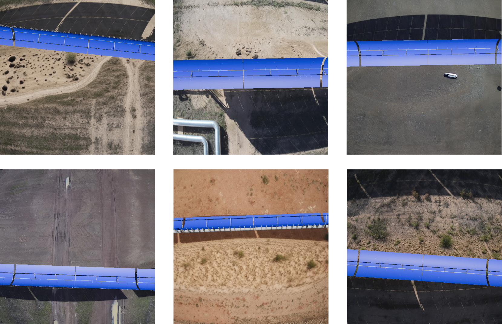

# AerialCSP Dataset

## Introduction

AerialCSP is a virtual dataset that simulates aerial imagery of Concentrated Solar Power plants. By generating
synthetic data that closely mimics real-world conditions, we aim to facilitate pretraining of models before deployment,
significantly reducing the need for extensive manual labeling.

## Dataset Overview

The final AerialCSP dataset is created by compositing the rendered Blender images onto the inpainted backgrounds. To introduce variability, we apply random scaling and rotations to the synthetic SCE images before pasting them onto the backgrounds. These transformations are also applied to the corresponding segmentation masks to maintain annotation consistency. AerialCSP is designed to support two primary computer vision tasks:

* **Object Detection:** Each image is accompanied by a YOLO-formatted annotation file containing bounding box information. The annotation format follows `<class> <x_center> <y_center> <width> <height>`, where all coordinates are normalized (0 to 1), and class indices are zero-indexed.
* **Instance Segmentation:** Segmentation masks are stored in a format where each line corresponds to an object and follows `<class-index> <x1> <y1> <x2> <y2> ... <xn> <yn>`, where (x, y) coordinates define the polygonal mask of the object and are normalized within [0,1]. Additionally, we provide the masks as grayscale images, where each pixel value corresponds to a different class. The user can extract their own segmentation format using these images directly. The class values associated to each object are stored in this [config](classes_dict.json) file.

To ensure fair comparisons, we provide a standardized dataset split into training, validation, and test sets, following a 75%-15%-10% distribution. In total, AerialCSP contains 18 058 labeled images.

## Using the Dataset

The AerialCSP dataset is available as a zip file containing the following structure

1. A folder named `cfg_train_val_test_split` where we provide a standardized dataset split to ensure fair comparisons, using three txt files containing the names of the images on the traning, validation and test set.
2. A folder named `images_and_masks` where we store the rendered images and segmentation masks.
3. A folder named `labels_per_task` containing two additional folders. Each folder contains the labels for a specific task, that is, bounding box detection or image segmentation in YOLO format.

## Benchmarks

We use YOLOv11 (https://docs.ultralytics.com/models/yolo11/) to provide some benchmarks to our dataset. The results are shown in the following table:

| Model           | Task                   | mAP50 (mean Average Precision) |
|-----------------|------------------------|--------------------------------|
| YOLOv11n        | Bounding Box Detection | 95.3                           |
| YOLOv11m        | Bounding Box Detection | 96.2                           |
| YOLOv11x        | Bounding Box Detection | 96.1                           |
| YOLOv11n-seg    | Image Segmentation     | 70.7                           |
| YOLOv11m-seg    | Image Segmentation     | 73.2                           |
| YOLOv11x-seg    | Image Segmentation     | 73.3                           |

## Download the Dataset

You can download the AerialCSP dataset from [the following link](https://uses0-my.sharepoint.com/:f:/g/personal/migpercut_alum_us_es/EioSpSmJBZBKlqZKWqIpoowBuYUbvNKg-_s_pOmzuyQ0KA?e=BCYjM9)

AerialCSP is property of [Virtualmechanics S.L.](https://virtualmech.com/) 

This repository and AerialCSP are intended for research and educational purposes only. For commercial use, please contact the authors.

AerialCSP is realased under the **Creative Commons Attribution-NonCommercial-ShareAlike 4.0 International (CC BY-NC-SA 4.0)** license.

## Citation

If you use the AerialCSP dataset in your research, please cite the following paper:

Pérez-Cutiño, M. A., Valverde, J., Capitán, J., Díaz-Bañez, J. M. (2025). Reducing the gap between general purpose data and aerial images in concentrated solar power plants.  *arXiv preprint*, DOI: https://doi.org/10.48550/arXiv.2508.00440.

<strong>BibTeX</strong>

    @article{perez2025reducing, 
    title={Reducing the gap between general purpose data and aerial images in concentrated solar power plants}, 
    author={Pérez-Cutiño, Miguel-Angel and  Valverde, Juan and Capitán, Jesús and Díaz-Bañez, José-Miguel}, 
    journal={arXiv preprint arXiv:2508.00440},
    year={2025}}

